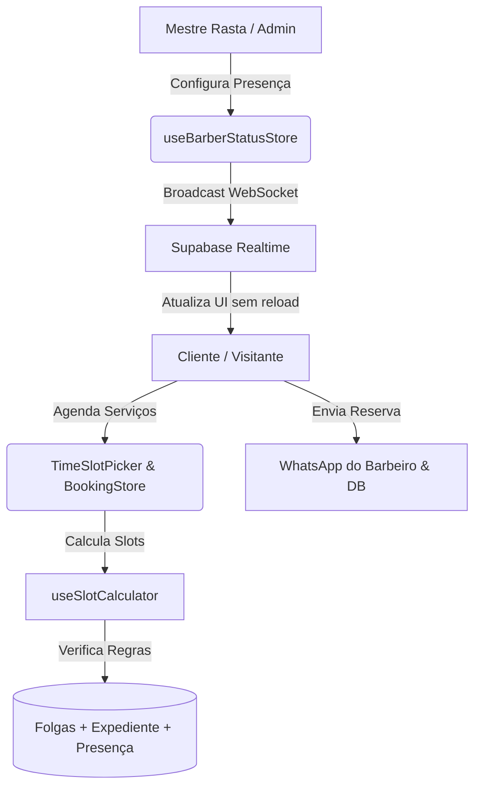

# 💈 Relatório Técnico de Arquitetura & Engenharia: Rasta Barber

---

## 1. Visão Geral da Solução
O **Rasta Barber** é uma Progressive Web Application (PWA/SPA) completa voltada para barbearias de alto padrão. O sistema opera em dois ecossistemas integrados:
1. **Área Pública / Autoatendimento do Cliente**: Agendamento multi-serviços com cálculo dinâmico de horários livres, consulta de status do barbeiro em tempo real e consulta de agendamentos por WhatsApp/telefone.
2. **Painel Administrativo do Barbeiro**: Gestão operacional, métricas de faturamento diário, controle de presença (Online Imediato e Programação de Horários), catálogo de serviços, bloqueio de folgas no calendário e customização do expediente semanal.

---

## 2. Stack Tecnológica

| Camada | Tecnologia | Detalhes de Implementação |
| :--- | :--- | :--- |
| **Core Framework** | **Nuxt 3** (`Vue 3` + `TypeScript`) | Composition API, `<script setup>`, File-based Routing, Middlewares de rota, Layouts dinâmicos. |
| **Gerenciamento de Estado** | **Pinia 2** | Stores modulares reativas (`auth`, `barberStatus`, `booking`, `services`). |
| **Estilização & Design System** | **Tailwind CSS** | Design system exclusivo *Roots & Clean* (Verde Rasta `#16a34a`, Ouro `#d97706`, Vermelho `#dc2626`), tipografia *Plus Jakarta Sans*. |
| **Banco de Dados & Realtime** | **Supabase (PostgreSQL)** | PostgreSQL relacional, Row Level Security (RLS), triggers de automação e **WebSockets Realtime** para atualização de presença instantânea. |
| **Integração Externa** | **WhatsApp API Gateway** | Deep linking dinâmico com payload pré-formatado para confirmação instantânea de reservas no WhatsApp do barbeiro. |
| **Resiliência Offline** | **Dual-Layer Storage** | Sincronização híbrida: consome Supabase se disponível, com fallback automático em `localStorage` para funcionamento autônomo. |

---

## 3. Arquitetura de Estado & Lógica de Negócios



### 3.1. Algoritmo de Cálculo de Slots (`useSlotCalculator.ts`)
O motor de agendamento não utiliza horários fixos engessados; ele calcula em tempo de execução os blocos disponíveis:
1. **Validação de Folgas**: Verifica se a data selecionada está na lista de `blocked_dates` (folgas pontuais do barbeiro).
2. **Expediente Semanal**: Obtém `start_time` e `end_time` cadastrados para aquele dia da semana (0=Dom a 6=Sáb).
3. **Presença Programada**: Se o barbeiro programou que naquele dia específico começará a partir de um horário customizado (ex: 14:00), o sistema desloca dinamicamente a abertura do dia para as 14:00.
4. **Almoço / Intervalo**: Exclui intersecções com `lunch_start` e `lunch_end`.
5. **Duração Acumulada**: Se o cliente escolheu Corte + Barba + Sobrancelha (ex: 75 min), calcula se o bloco `slotStart + 75min` cabe no intervalo sem ultrapassar o fechamento e sem colidir com outros agendamentos existentes.
6. **Filtro de Passado**: Para a data de hoje, bloqueia horários anteriores à hora atual (+15 min de tolerância).

---

### 3.2. Controle de Presença em Tempo Real (`barberStatus.ts`)
O status do barbeiro possui 3 modos operacionais:
* **Online Agora (`immediate`)**: Barbeiro ativo na loja. Aciona badge verde pulsante em todos os clientes conectados.
* **Programado (`scheduled`)**: Barbeiro define previamente o dia (*Hoje, Amanhã ou Data futura*) e a partir de que horário estará na loja (*ex: a partir das 14:00*). Exibe banner informativo de pré-agendamento e ajusta a grade de horários daquele dia.
* **Offline (`offline`)**: Barbearia fechada ou dia de descanso.

---

### 3.3. Autenticação e Segurança (`stores/auth.ts` & `middleware/admin.ts`)
* **Login Administrativo**: Suporta autenticação direta por **usuário e senha** (`rastabarber123` / `admin123`) ou credenciais Supabase.
* **Proteção de Rotas**: O middleware `middleware/admin.ts` intercepta todas as páginas sob `/admin/*` e redireciona usuários não autenticados ou clientes comuns para `/login`.

---

## 4. Modelagem de Dados Relacional (`schema.sql`)

```
┌─────────────────┐       ┌──────────────────────┐       ┌──────────────────────┐
│    profiles     │       │     barber_status    │       │     working_hours    │
├─────────────────┤       ├──────────────────────┤       ├──────────────────────┤
│ id (PK, UUID)   │       │ id (PK = 1)          │       │ id (PK, UUID)        │
│ role (client/b.)│       │ is_online (BOOL)     │       │ day_of_week (0-6)    │
│ full_name       │       │ status_mode (TEXT)   │       │ is_working (BOOL)    │
│ phone           │       │ scheduled_date (TEXT)│       │ start_time (HH:mm)   │
└────────┬────────┘       │ scheduled_time (TEXT)│       │ end_time (HH:mm)     │
         │                │ last_updated         │       │ lunch_start/end      │
         │                └──────────────────────┘       └──────────────────────┘
         │ 1:N
┌────────┴────────┐       ┌──────────────────────┐       ┌──────────────────────┐
│  appointments   │ 1:N   │ appointment_services │ N:1   │       services       │
├─────────────────┼───────┼──────────────────────┼───────┼──────────────────────┤
│ id (PK, UUID)   │       │ appointment_id (FK)  │       │ id (PK, UUID)        │
│ client_id (FK)  │       │ service_id (FK)      │       │ name (TEXT)          │
│ client_name     │       │ price_at_booking     │       │ price (NUMERIC)      │
│ client_phone    │       └──────────────────────┘       │ duration_minutes     │
│ appointment_date│                                      │ is_active (BOOL)     │
│ start_time/end  │       ┌──────────────────────┐       └──────────────────────┘
│ status          │       │    blocked_dates     │
│ total_price     │       ├──────────────────────┤
└─────────────────┘       │ date (PK, YYYY-MM-DD)│
                          │ reason (TEXT)        │
                          └──────────────────────┘
```

---

## 5. Estrutura de Diretórios e Componentes

```
rasta-barber/
├── assets/
│   ├── css/main.css              # Variáveis CSS, ribbons tricolor, resets
│   └── rastabarberlogo.png       # Identidade visual oficial
├── components/
│   ├── admin/                    # Componentes exclusivos do painel administrativo
│   │   ├── CalendarDayOffManager # Calendário interativo para bloquear/desbloquear folgas
│   │   ├── StatusToggle.vue      # Painel de controle de presença (Online, Programado, Offline)
│   │   └── WorkingHoursEditor    # Editor semanal de expediente e horário de almoço
│   ├── client/                   # Componentes voltados para o cliente
│   │   ├── BarberLiveBanner.vue  # Banner hero que reage ao status do barbeiro
│   │   ├── BookingSummaryModal   # Modal de confirmação e disparo WhatsApp
│   │   ├── ServiceCard.vue       # Card de seleção de serviços (multi-seleção)
│   │   └── TimeSlotPicker.vue    # Seletor visual de datas (14 dias) e slots de horários
│   └── ui/                       # Componentes base reutilizáveis (BaseButton, AppNavbar, StatusBadge)
├── composables/
│   └── useSlotCalculator.ts      # Motor de cálculo e alocação de horários
├── layouts/
│   ├── default.vue               # Layout público com Navbar, Ribbon e Footer
│   └── admin.vue                 # Layout administrativo com Sidebar lateral e Topbar mobile
├── middleware/
│   └── admin.ts                  # Guarda de rota para permissões do barbeiro
├── pages/
│   ├── index.vue                 # Landing page com vitrine de serviços e banner live
│   ├── agendar.vue               # Fluxo guiado de agendamento em etapas
│   ├── meus-agendamentos.vue     # Consulta de reservas do cliente via telefone
│   ├── login.vue                 # Autenticação do barbeiro
│   └── admin/
│       ├── index.vue             # Dashboard do dia (faturamento, concluídos, fila)
│       ├── agendamentos.vue      # Calendário e listagem completa de reservas
│       ├── servicos.vue          # Gestão CRUD de catálogo de serviços e preços
│       └── agenda.vue            # Gestão de horários de expediente e folgas
├── stores/
│   ├── auth.ts                   # Sessão, perfil e credenciais do admin
│   ├── barberStatus.ts           # Presença em tempo real e programação de horários
│   ├── booking.ts                # Carrinho de agendamento e sincronização de reservas
│   └── services.ts               # Catálogo de serviços ativos e persistência
├── supabase/
│   └── schema.sql                # DDL completo, RLS, triggers e publicação Realtime
└── tailwind.config.ts            # Tokens do tema Rasta Roots
```

---

## 6. Destaques de Experiência do Usuário (UX/UI)
1. **Design System Personalizado**: Cores autênticas com estética *Roots Modern*, badges informativos e feedback com micro-animações.
2. **Confirmação WhatsApp com 1 Clique**: Ao concluir o agendamento, o cliente é direcionado ao WhatsApp com o texto já montado detalhando serviços, data, hora, endereço e valor total.
3. **Resiliência e Agilidade**: Todas as telas funcionam com resposta instantânea e salvamento preventivo, garantindo que o sistema funcione com ou sem conexão ativa com o banco remoto.
